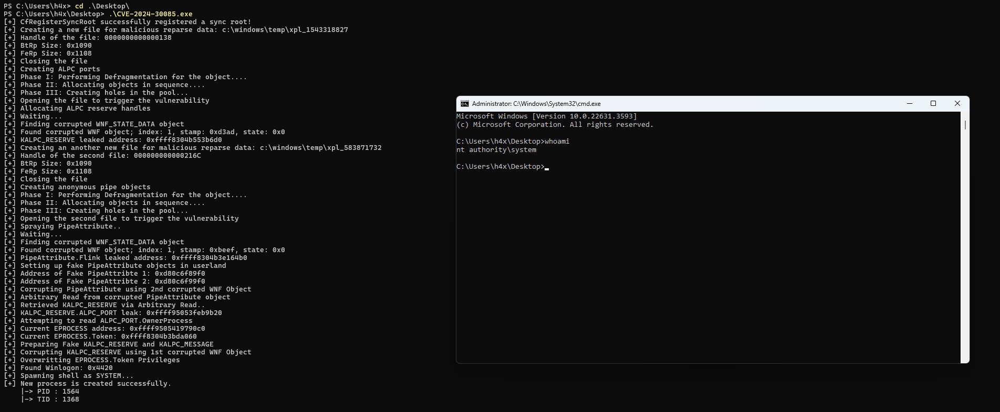

# CVE-2024-30085

**Title:** Windows Cloud Files Mini Filter Driver Elevation of Privilege Vulnerability  
**CVE-2024-49138:** https://msrc.microsoft.com/update-guide/vulnerability/CVE-2024-30085  
**Vulnerability Type:** Heap-based Buffer Overflow  
**Tested On:** cldflt.sys - 10.0.22621.3593  

## Description

CVE-2024-30085 is a heap-based buffer overflow in the Windows Cloud Files Mini-Filter `cldflt.sys`, exploited via a specially crafted reparse-point on a Cloud Files (OneDrive) sync folder. In unpatched `cldflt.sys` allocates a 0x1000-byte buffer (a “HsBm” object) in paged pool and copies user-controlled data of size `memcpy_size` into it. By supplying a `memcpy_size` larger than 0x1000, the exploit overruns this heap buffer into the next object. This leads to a heap-based buffer overflow, ultimately resulting in privilege escalation.

## Exploit

Tested on: Windows 11 22H2 (OS Build 19045.6093)

## Acknowledgements

- It was explained by Cherie-Anne Lee and Chen Le Qi, it can be found [here](https://starlabs.sg/blog/2024/all-i-want-for-christmas-is-a-cve-2024-30085-exploit/).
- The [PoC](https://github.com/star-sg/CVE/tree/master/CVE-2024-30085) was developed by [Cherie-Anne Lee](https://github.com/KaligulaArmblessed), and the above PoC is based on it.
