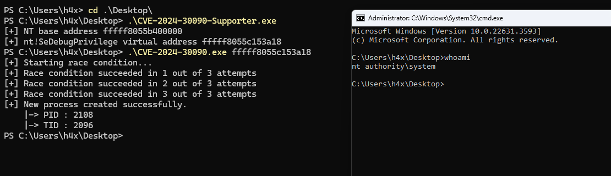

# CVE-2024-30090

**Title:** Microsoft Streaming Service Elevation of Privilege Vulnerability  
**CVE-2024-30090:** https://msrc.microsoft.com/update-guide/vulnerability/CVE-2024-30090/  
**Vulnerability Type:** Untrusted Pointer Dereference  
**Tested On:** ks.sys - 10.0.22621.2506 & ksthunk.sys - 10.0.22621.1  

## Description

CVE-2024-30090 is a privilege escalation vulnerability in the Microsoft Kernel Streaming driver (`ks.sys`) caused by a race condition in the handling of event notifications via IOCTL_KS_ENABLE_EVENT. Specifically, the vulnerability stems from a logic flaw in ksthunk!CKSAutomationThunk::ThunkEnableEventIrp, where input buffers are copied and reused across multiple code paths without proper synchronization. By racing between KSEVENT_TYPE_ENABLE and KSEVENT_TYPE_QUERYBUFFER flags, an attacker can trick the kernel into invoking KsSynchronousIoControlDevice with KernelMode privileges while supplying attacker-controlled data.

## Exploit

Tested on: Windows 11 23H2 (05-2024 Build)

`DebugAddress.cpp` should be compiled as a 64-bit binary. `source.cpp` should be compiled as a 32-bit binary.

## Acknowledgements

- The original research on Kernel Streaming was conducted by [Angelboy](https://x.com/scwuaptx), and it can be found [here](https://devco.re/blog/2024/10/05/streaming-vulnerabilities-from-windows-kernel-proxying-to-kernel-part2-en/).
- The [PoC](https://github.com/Dor00tkit/CVE-2024-30090/) was developed by Dor00tkit, and the above PoC is based on it.
